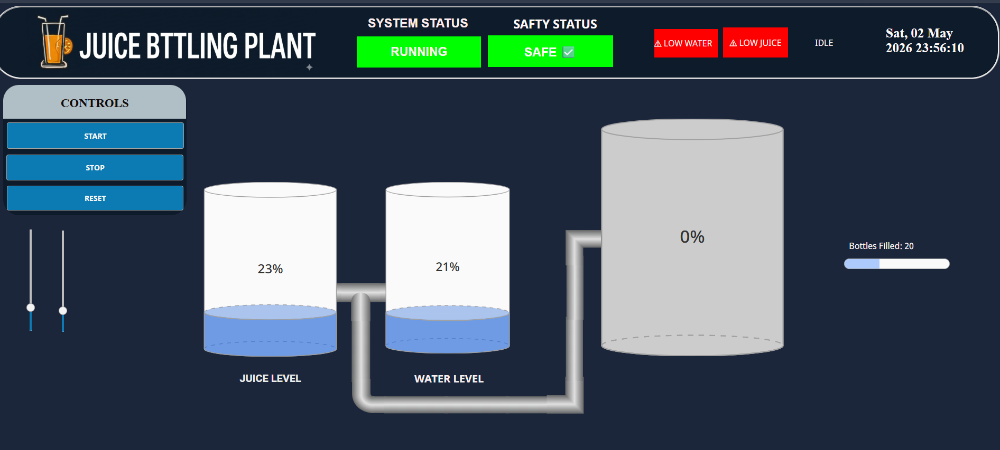
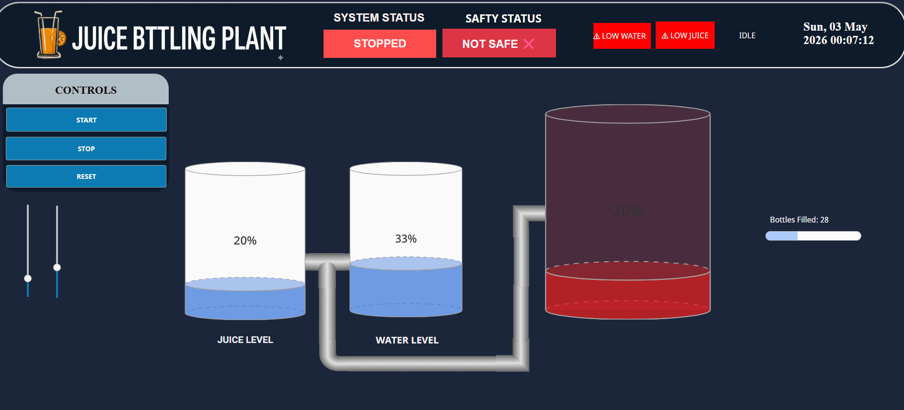

# Ignition Juice Bottling Plant SCADA

An industrial automation simulation of a juice bottling plant developed using **Inductive Automation Ignition SCADA with the Perspective Module**.

The project demonstrates real-time process monitoring, supervisory control, process visualization, safety interlocks, alarm management, equipment status monitoring, and production-oriented data visualization.

---

## Project Overview

The Juice Bottling Plant SCADA project is a software-based industrial automation simulation designed to demonstrate how a manufacturing process can be monitored and controlled through a modern SCADA system.

The system uses **Ignition Perspective** to provide a browser-based operator interface for monitoring process conditions, equipment states, safety status, alarms, and production information.

The project focuses on developing an operator-oriented SCADA interface rather than physical industrial production deployment.

---

## Key Features

- Real-time process visualization
- Ignition Perspective HMI development
- Industrial SCADA architecture
- Equipment status monitoring
- Start/Stop control
- Safety interlocks
- Emergency-stop indication
- Alarm monitoring
- Fault indication
- Process status visualization
- Production monitoring
- Tank/level monitoring
- Conveyor/process monitoring
- Historical data and trend concepts
- Operator-oriented dashboard design
- PLC/SCADA communication concepts
- Industrial automation workflow

---

## Technology Stack

| Technology | Purpose |
|---|---|
| Ignition SCADA | Supervisory control and monitoring |
| Ignition Perspective | Browser-based HMI / visualization |
| Ignition Gateway | SCADA runtime and communication layer |
| PLC / PLC Simulation | Control logic representation |
| OPC UA | Industrial communication |
| SQL / Database | Historical and production data concepts |
| Industrial Automation | Process control architecture |

---

## System Architecture

The project follows a layered industrial automation architecture:

```text
+-----------------------------+
|       Operator / User       |
+-------------+---------------+
              |
              v
+-----------------------------+
|    Ignition Perspective     |
|       HMI / Dashboard       |
+-------------+---------------+
              |
              v
+-----------------------------+
|       Ignition Gateway      |
|   Tags / Alarms / Services  |
+-------------+---------------+
              |
              v
+-----------------------------+
|          OPC UA             |
|  Industrial Communication   |
+-------------+---------------+
              |
              v
+-----------------------------+
|       PLC / Simulation      |
|       Control Logic         |
+-------------+---------------+
              |
              v
+-----------------------------+
|     Simulated Process       |
|   Juice Bottling Operations |
+-----------------------------+
```

---

## Process Monitoring

The SCADA interface provides an operator-level overview of the simulated juice bottling process.

The Perspective dashboard is designed to monitor:

- System operating status
- Safety status
- Tank levels
- Process flow
- Equipment states
- Operator controls
- Production information
- Alarm and fault conditions

The dashboard allows the operator to observe the process through a centralized visualization interface.

### Main Process Elements

| Process Element | Monitoring Function |
|---|---|
| Juice Tank | Monitors juice level |
| Water Tank | Monitors water level |
| Process Equipment | Displays operating status |
| Conveyor | Represents material movement |
| Control Panel | Provides operator commands |
| Safety System | Displays safety/interlock status |
| Alarm System | Displays abnormal conditions |
| Production Section | Displays production information |

---

## SCADA Dashboard

The main Ignition Perspective dashboard provides a centralized operator interface for monitoring the simulated juice bottling plant.



### Dashboard Functions

The dashboard provides visualization of:

- System status
- Safety status
- Process conditions
- Tank levels
- Equipment states
- Operator controls
- Alarm conditions
- Production information

---

## Control Logic

The simulated process follows a sequence-based control approach.

The general operating sequence is:

```text
System Initialization
        |
        v
Safety / Interlock Check
        |
        v
Start Command
        |
        v
Process Operation
        |
        v
Monitor Process Sensors
        |
        v
Update Process Status
        |
        v
Monitor Fault Conditions
        |
        +------ Fault ------> Safe Stop
        |
        v
Continue Operation
```

The control logic is designed so that the process operates when the required permissive and safety conditions are satisfied.

---

## Safety Interlocks

Safety conditions are monitored before and during process operation.

Typical safety conditions include:

- Emergency stop
- Equipment fault
- Process fault
- Sensor fault
- Communication fault
- Unsafe operating condition

When a critical safety condition occurs, the process is designed to transition to a safe stopped state and generate an appropriate alarm.

---

## Alarm Management

The SCADA system provides alarm monitoring for abnormal process conditions.

Example alarm conditions include:

| Alarm | Trigger | Expected Response |
|---|---|---|
| Emergency Stop | E-Stop activated | Process enters safe state |
| Process Fault | Process fault detected | Process stops / alarm generated |
| Equipment Fault | Equipment fault detected | Equipment status changes |
| Communication Fault | Data unavailable | Communication alarm |
| Sensor Fault | Invalid sensor condition | Sensor fault indication |

The alarm interface is intended to provide operators with clear information about abnormal process conditions.

---

## Historical Data and Trends

Historical process data can be used for:

- Production analysis
- Process monitoring
- Fault investigation
- Downtime analysis
- Trend analysis
- Performance monitoring

Potentially monitored variables include:

- Tank levels
- Equipment states
- Production counts
- Process states
- Fault events
- Alarm events
- Start/Stop events

---

## Testing and Validation

The system can be evaluated under both normal and abnormal operating conditions.

| Test Case | Condition | Expected Result |
|---|---|---|
| Start | Start command activated | Process starts |
| Stop | Stop command activated | Process stops |
| Emergency Stop | E-Stop activated | System enters safe state |
| Process Fault | Fault condition activated | Alarm generated |
| Sensor Event | Sensor activated | Process state updates |
| Communication Loss | Data unavailable | Communication fault indicated |

The validation process checks whether operator commands, process states, alarms, safety conditions, and SCADA visualization respond as expected.

---

## Project Workflow

```text
Process Requirement
        |
        v
Identify Process Variables
        |
        v
Develop Control Logic
        |
        v
PLC / Process Simulation
        |
        v
OPC UA Communication
        |
        v
Ignition Gateway
        |
        v
SCADA Tags
        |
        v
Perspective HMI
        |
        v
Alarms & Safety Interlocks
        |
        v
Historical Data
        |
        v
Testing & Validation
```

---

## Project Screenshots

### Main SCADA Dashboard


### Process Overview


### Alarm Monitoring



### Historical Trends


---

## Project Objectives

1. Develop an industrial automation SCADA simulation.
2. Develop a Perspective-based operator interface.
3. Demonstrate real-time process monitoring.
4. Represent industrial control logic.
5. Demonstrate safety interlocks.
6. Demonstrate alarm and fault monitoring.
7. Organize process variables using SCADA tags.
8. Study PLC-to-SCADA communication concepts.
9. Demonstrate production and process monitoring.
10. Evaluate the system under normal and abnormal conditions.

---

## Skills Demonstrated

- Industrial Automation
- SCADA
- Ignition Perspective
- HMI Development
- PLC Concepts
- OPC UA Communication
- SCADA Tag Management
- Alarm Management
- Safety Interlocks
- Process Visualization
- Industrial System Architecture
- System Testing
- Technical Documentation

---

## Future Improvements

Possible future extensions include:

- Physical PLC integration
- Industrial sensor integration
- Industrial drive integration
- Factory I/O integration
- Advanced production analytics
- OEE dashboard
- MQTT / IIoT integration
- Predictive maintenance
- Role-based user management
- Advanced reporting
- MES integration
- Multi-station production simulation

---

## Project Status

**Status:** Academic Industrial Automation Simulation

**Platform:** Ignition SCADA Perspective

**Domain:** Industrial Automation / SCADA / HMI

---

## Documentation

The project documentation and related internship report can be added to the `documentation` directory.

The documentation covers industrial automation, SCADA architecture, Ignition Perspective, OPC UA communication, PLC concepts, tag architecture, alarm management, historical data, and system testing.

---

## Disclaimer

This repository represents a software-based industrial automation simulation and educational project.

It is not intended to represent a commissioned production system or a safety-certified industrial installation.

---

## Author

**Rithikswaran R**

B.Tech – Automation and Robotics Engineering  
Amrita Vishwa Vidyapeetham, Coimbatore
